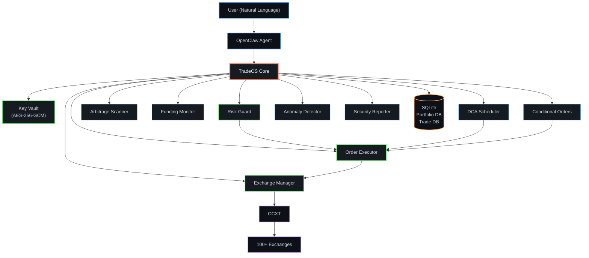

<div align="center">

<pre>
████████╗██████╗  █████╗ ██████╗ ███████╗ ██████╗ ███████╗
╚══██╔══╝██╔══██╗██╔══██╗██╔══██╗██╔════╝██╔═══██╗██╔════╝
   ██║   ██████╔╝███████║██║  ██║█████╗  ██║   ██║███████╗
   ██║   ██╔══██╗██╔══██║██║  ██║██╔══╝  ██║   ██║╚════██║
   ██║   ██║  ██║██║  ██║██████╔╝███████╗╚██████╔╝███████║
   ╚═╝   ╚═╝  ╚═╝╚═╝  ╚═╝╚═════╝ ╚══════╝ ╚═════╝ ╚══════╝
</pre>

### `> Institutional-grade CEX trading infrastructure for AI agents_`

<br />

[](https://github.com/00xLazy/TradeOS/releases)
[](https://www.typescriptlang.org/)
[](https://github.com/ccxt/ccxt)
[](./LICENSE)
[](https://github.com/openclaw/openclaw)

<br />

[English](./README.md) · [简体中文](./README_CN.md)

<br />


</div>

<div align="center">

## What is TradeOS?

**One sentence to trade. One layer to rule them all.**

</div>

<div align="center">

TradeOS is an [OpenClaw](https://github.com/openclaw/openclaw) Skill that transforms natural language into secure, auditable exchange operations across **100+ centralized cryptocurrency exchanges**. It functions as a complete trading infrastructure layer — handling key management, order execution, risk enforcement, portfolio analytics, and autonomous strategies — so AI agents can operate with the same rigor expected of institutional trading desks.

</div>

<div align="center">

<table>
<tr><td>

- All keys encrypted at rest **(AES-256-GCM)**
- All data stays local — **zero cloud dependency**
- All trades require **explicit confirmation**

</td></tr>
</table>

<br />


## Feature Matrix

</div>

<div align="center">
<table>
<tr>
<td width="50%">

**Security & Infrastructure**

| Module | Capability |
|:--|:--|
| **Key Vault** | AES-256-GCM + PBKDF2 (600K iter) |
| **Risk Guard** | Per-order limits, daily caps, leverage ceilings |
| **Anomaly Detection** | Balance drops, unknown orders, API failures |
| **Security Auditor** | Per-exchange health scoring |

</td>
<td width="50%">

**Trading & Analytics**

| Module | Capability |
|:--|:--|
| **Trading Engine** | Market / Limit / Stop / TP across spot & futures |
| **Portfolio Tracker** | Multi-exchange aggregation & snapshots |
| **PnL Reports** | Daily, weekly, monthly & quarterly reports |

</td>
</tr>
<tr>
<td width="50%">

**Autonomous Strategies**

| Module | Capability |
|:--|:--|
| **DCA Scheduler** | Hourly / Daily / Weekly / Monthly auto-buys |
| **Conditional Orders** | Price triggers, once or recurring + cooldowns |

</td>
<td width="50%">

**Market Intelligence**

| Module | Capability |
|:--|:--|
| **Arbitrage Scanner** | Cross-exchange spread detection (net of fees) |
| **Funding Rates** | Perpetual contract yield tracking & alerts |

</td>
</tr>
</table>
</div>

<div align="center">
<br />


## Architecture

</div>



<div align="center">
<br />


## Quick Start

</div>

```bash
# 1. Clone into your OpenClaw skills directory
git clone https://github.com/00xLazy/TradeOS.git ~/.openclaw/skills/TradeOS

# 2. Install & build
cd ~/.openclaw/skills/TradeOS && npm install && npm run build
```

<div align="center">

Then, in your OpenClaw agent:

</div>

```
> "Initialize my TradeOS vault with a master password."
> "Add my Binance API key. The key is XXXX and the secret is YYYY."
```

<div align="center">

TradeOS will encrypt the credentials, verify the connection, check permission scopes, and **reject any key with withdrawal access enabled**.

<br />


## Supported Exchanges

| Exchange | ID | Spot | Futures | |
|:--|:--|:--:|:--:|:--|
| **Binance** | `binance` | Yes | Yes | World's largest by volume |
| **OKX** | `okx` | Yes | Yes | Advanced derivatives platform |
| **Bybit** | `bybit` | Yes | Yes | Leading perpetuals exchange |
| **Gate.io** | `gateio` | Yes | Yes | 1700+ trading pairs |
| **Bitget** | `bitget` | Yes | Yes | Copy-trading leader |
| **Coinbase** | `coinbase` | Yes | — | Regulated US exchange |
| **KuCoin** | `kucoin` | Yes | Yes | The people's exchange |
| **HTX** | `htx` | Yes | Yes | Global digital asset platform |
| **MEXC** | `mexc` | Yes | Yes | Fast listing exchange |
| **Crypto.com** | `cryptocom` | Yes | — | Consumer-friendly platform |

**100+ additional exchanges** supported via [CCXT](https://github.com/ccxt/ccxt). If your exchange speaks REST, TradeOS can trade on it.

<br />


## Usage Examples

</div>

<details open>
<summary><strong>Trading</strong></summary>

```
You:     Buy 0.1 BTC on Binance at market price.

TradeOS: Order Preview
         ─────────────────────────────────────
         Exchange:    Binance
         Pair:        BTC/USDT
         Side:        BUY
         Type:        Market
         Amount:      0.1 BTC
         Est. Cost:   ~$8,430.20
         Est. Fee:    ~$8.43
         Risk Check:  PASSED
         ─────────────────────────────────────
         Reply "confirm" to execute.

You:     confirm

TradeOS: Filled @ $84,302.50 | 0.1 BTC | Fee: 0.0001 BTC
```

</details>

<details>
<summary><strong>DCA Automation</strong></summary>

```
You:     Set up a daily DCA plan to buy $100 of ETH on Bybit at 9am.

TradeOS: DCA Plan Created
         ─────────────────────────────────────
         Name:       Daily ETH DCA
         Exchange:   Bybit
         Pair:       ETH/USDT
         Amount:     $100/day @ 09:00 UTC
         Status:     RUNNING
         Next exec:  Tomorrow 09:00
```

</details>

<details>
<summary><strong>Arbitrage Scanning</strong></summary>

```
You:     Scan for arbitrage on BTC/USDT across Binance, OKX, and Bybit.

TradeOS: Arbitrage Results — BTC/USDT
         ─────────────────────────────────────
         Buy on OKX:        $84,290 (ask)
         Sell on Binance:   $84,350 (bid)
         Gross spread:      0.071%
         Net profit:        0.051% (after fees)
         ─────────────────────────────────────
         Below 0.1% threshold — monitor only
```

</details>

<details>
<summary><strong>Portfolio Overview</strong></summary>

```
You:     Show me my total balance across all exchanges.

TradeOS: Portfolio Summary
         ─────────────────────────────────────
         Binance .............. $45,230.00
         OKX ................. $12,800.00
         Bybit ................. $3,200.00
         ─────────────────────────────────────
         Total:              $61,230.00

         ██████████████░░░░░░ BTC   42%
         █████████░░░░░░░░░░░ ETH   20%
         ███████░░░░░░░░░░░░░ USDT  31%
         ██░░░░░░░░░░░░░░░░░░ SOL    7%
```

</details>

<details>
<summary><strong>Conditional Orders</strong></summary>

```
You:     If ETH drops below $3,000, buy 2 ETH on OKX.

TradeOS: Conditional Order Created
         ─────────────────────────────────────
         Trigger:    ETH/USDT < $3,000.00
         Action:     BUY 2 ETH @ Market
         Exchange:   OKX
         Mode:       One-time
         Status:     MONITORING (every 15s)
```

</details>

<div align="center">
<br />


## Data Storage

All data is stored **locally on your machine**. Nothing is transmitted to external servers.

</div>

```
~/.openclaw/skills/TradeOS/
│
├── vault/
│   └── exchanges.enc.json          Encrypted API credentials
│
├── data/
│   ├── portfolio.db                Asset snapshots (SQLite)
│   └── trades.db                   Trade records (SQLite)
│
├── alerts/
│   └── rules.json                  Alert rule definitions
│
├── dca/
│   ├── plans.json                  DCA plan configurations
│   └── history.json                DCA execution log
│
├── arbitrage/
│   └── config.json                 Arbitrage scanner settings
│
├── funding/
│   └── config.json                 Funding rate monitor settings
│
├── conditional-orders/
│   ├── orders.json                 Conditional order definitions
│   └── history.json                Execution history
│
├── anomaly/
│   ├── config.json                 Anomaly detection settings
│   └── snapshots.json              Balance snapshot history
│
├── security/
│   ├── config.json                 Security auditor settings
│   └── last-report.json            Most recent security report
│
└── risk-rules.json                 Risk management rules
```

<div align="center">
<br />


## Security

</div>

<div align="center">
<table>
<tr>
<td>

**TradeOS Enforces**

- **AES-256-GCM** encryption for all stored credentials
- Automatic **rejection** of keys with withdrawal access
- Mandatory **preview + confirm** flow for manual trades
- File permissions set to **`chmod 600`** (owner-only)
- Full API key **masking** in logs and chat output
- Risk guard **always active** — even for automated strategies

</td>
<td>

**You Should Configure**

- **Never** enable withdrawal on API keys
- **IP whitelist** on every exchange API key
- **Strong, unique** master password for the vault
- **Risk limits** matching your risk tolerance
- Run on a **secure, private** machine

</td>
</tr>
</table>
</div>

<div align="center">
<br />


## Skill Combo: TradeOS + CoinAnk

</div>

<div align="center">

Install both **TradeOS** and [**CoinAnk API Skill**](https://github.com/coinank/coinank-openapi-skill) in OpenClaw to unlock a complete **"see the market + execute trades"** closed loop.

</div>

<div align="center">
<table>
<tr>
<td width="50%">

**CoinAnk = Eyes**

18 categories, 59 real-time derivatives data endpoints: K-lines, liquidation heatmaps, funding rates, long/short ratios, order flow, whale movements, fear & greed index, and more.

</td>
<td width="50%">

**TradeOS = Hands**

100+ exchanges, market/limit/stop/TP orders, DCA automation, conditional orders, cross-exchange arbitrage scanning — all with built-in risk controls and confirmation gates.

</td>
</tr>
</table>
</div>

<div align="center">

Combine both, and a single sentence does what used to require multiple screens:

</div>

```
"Check BTC funding rates and the liquidation heatmap. If the rate exceeds 0.1%
 and the long/short ratio is skewed long, open a 2x short on Binance."

"Monitor ETH order flow. When a large sell signal appears,
 market-sell all my ETH automatically."

"Compare SOL funding rates across exchanges. Find the arb opportunity,
 then go long on the lowest-rate exchange and short on the highest."

"Every morning, send me a report: yesterday's BTC liquidation data
 + whale movements + my portfolio PnL."

"Use the Fear & Greed Index for DCA: buy $100 BTC daily when the index
 drops below 20, pause when it rises above 80."
```

<div align="center">

One Skill watches. The other executes. Data-driven decisions, AI-powered trades.

<br />

</div>

<details>
<summary><strong>Project Structure</strong></summary>

<br />

| Module | File | Role |
|:--|:--|:--|
| Entry Point | `scripts/index.ts` | Initializes and exports all modules |
| Key Vault | `scripts/key-vault.ts` | AES-256-GCM credential encryption and storage |
| Exchange Manager | `scripts/exchange-manager.ts` | CCXT exchange connections, balances, tickers |
| Order Executor | `scripts/order-executor.ts` | Order preview, confirmation, and execution |
| Risk Guard | `scripts/risk-guard.ts` | Pre-trade risk checks and enforcement |
| Portfolio Tracker | `scripts/portfolio-tracker.ts` | Multi-exchange balance aggregation and snapshots |
| Balance Monitor | `scripts/balance-monitor.ts` | Price, balance, and drawdown alerts |
| PnL Tracker | `scripts/pnl-tracker.ts` | Trade history and performance reports |
| DCA Scheduler | `scripts/dca-scheduler.ts` | Automated dollar-cost averaging plans |
| Arbitrage Scanner | `scripts/arbitrage-scanner.ts` | Cross-exchange price spread detection |
| Funding Rate Monitor | `scripts/funding-rate-monitor.ts` | Perpetual contract funding rate analysis |
| Conditional Orders | `scripts/conditional-order.ts` | Trigger-based automated order execution |
| Anomaly Detector | `scripts/anomaly-detector.ts` | Account anomaly and integrity monitoring |
| Security Reporter | `scripts/security-reporter.ts` | API key health scoring and recommendations |
| Security Utilities | `scripts/security-utils.ts` | Shared cryptographic helpers |

</details>

<div align="center">

<br />

## License

[MIT License](./LICENSE) — 00xLazy

<br />


<br />

**Built with** [OpenClaw](https://github.com/openclaw/openclaw) · [CCXT](https://github.com/ccxt/ccxt) · [better-sqlite3](https://github.com/WiseLibs/better-sqlite3)

<br />

```
Built for autonomous trading infrastructure.
```

<br />

<sub>Made by <a href="https://github.com/00xLazy">00xLazy</a></sub>

</div>
