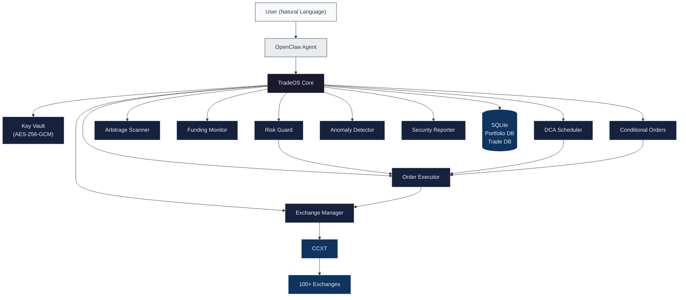

<div align="center">

# TradeOS

**Institutional-grade CEX trading infrastructure for AI agents**

<br />

[](https://github.com/00xLazy/TradeOS/releases)
[](https://www.typescriptlang.org/)
[](https://github.com/ccxt/ccxt)
[](./LICENSE)

<br />

🇬🇧 [English](./README.md) · 🇨🇳 [简体中文](./README_CN.md)

</div>

<br />

---

<br />

## Overview

TradeOS is an [OpenClaw](https://github.com/openclaw/openclaw) Skill that transforms natural language into secure, auditable exchange operations across 100+ centralized cryptocurrency exchanges. It functions as a complete trading infrastructure layer — handling key management, order execution, risk enforcement, portfolio analytics, and autonomous strategies — so AI agents can operate with the same rigor expected of institutional trading desks.

All data stays local. All keys are encrypted at rest. All trades require explicit confirmation or pre-authorized strategy rules.

<br />

## Feature Matrix

| Module | Capability | Details |
|:--|:--|:--|
| Key Vault | Encrypted credential storage | AES-256-GCM with PBKDF2 key derivation (600K iterations) |
| Trading Engine | Multi-exchange order execution | Market, limit, stop-loss, and take-profit orders across spot and futures |
| Risk Guard | Pre-trade risk enforcement | Configurable per-order limits, daily caps, leverage ceilings, and automatic blocking |
| DCA Automation | Dollar-cost averaging scheduler | Hourly, daily, weekly, or monthly buy plans with full PnL tracking |
| Arbitrage Scanner | Cross-exchange spread detection | Real-time bid/ask analysis with net-profit thresholds after fees |
| Funding Rate Monitor | Perpetual contract yield tracking | Annualized rate calculation with long/short opportunity alerts |
| Conditional Orders | Trigger-based execution | Price target and percentage-change triggers, once or recurring with cooldowns |
| Anomaly Detection | Account integrity monitoring | Balance drop alerts, unknown order detection, API failure tracking |
| Security Auditor | API key health scoring | Per-exchange scoring (age, permissions, IP whitelist, connectivity) |
| Portfolio Tracking | Multi-exchange asset aggregation | Unified balance view with allocation breakdowns and historical snapshots |
| PnL Reports | Performance analytics | Daily, weekly, monthly, and quarterly trade performance reports |

<br />

## Architecture



<br />

## Quick Start

**1. Clone and build**

```bash
git clone https://github.com/00xLazy/TradeOS.git ~/.openclaw/skills/TradeOS
cd ~/.openclaw/skills/TradeOS
npm install && npm run build
```

**2. Initialize the vault**

> "Initialize my TradeOS vault with a master password."

**3. Connect an exchange**

> "Add my Binance API key. The key is `XXXX` and the secret is `YYYY`."

TradeOS will encrypt the credentials, verify the connection, check permission scopes, and reject any key with withdrawal access enabled.

<br />

## Supported Exchanges

| Exchange | ID | Spot | Futures |
|:--|:--|:--:|:--:|
| Binance | `binance` | Yes | Yes |
| OKX | `okx` | Yes | Yes |
| Bybit | `bybit` | Yes | Yes |
| Gate.io | `gateio` | Yes | Yes |
| Bitget | `bitget` | Yes | Yes |
| Coinbase | `coinbase` | Yes | — |
| KuCoin | `kucoin` | Yes | Yes |
| HTX | `htx` | Yes | Yes |
| MEXC | `mexc` | Yes | Yes |
| Crypto.com | `cryptocom` | Yes | — |

> 100+ additional exchanges supported via [CCXT](https://github.com/ccxt/ccxt).

<br />

<details>
<summary><strong>Usage Examples</strong></summary>

<br />

All interaction happens through natural language with your OpenClaw agent.

**Trading**

> "Buy 0.1 BTC on Binance at market price."

TradeOS will preview the order (price, estimated cost, fees, risk checks), then wait for your explicit confirmation before executing.

**DCA**

> "Set up a daily DCA plan to buy $100 of ETH on Bybit at 9am."

Creates an autonomous recurring buy. Pre-authorized at creation — no per-execution confirmation needed. Risk guard remains active.

**Arbitrage**

> "Scan for arbitrage opportunities on BTC/USDT across Binance, OKX, and Bybit."

Returns net-profit spreads after estimated fees, using real bid/ask prices.

**Portfolio**

> "Show me my total balance across all exchanges."

Aggregates holdings from every connected exchange into a unified view with USD valuations and allocation percentages.

**Conditional Orders**

> "If ETH drops below $3,000, buy 2 ETH on OKX."

Creates a trigger-based order that monitors price and executes automatically when the condition is met.

</details>

<br />

## Data Storage

All data is stored locally on your machine. Nothing is transmitted to external servers.

```
~/.openclaw/skills/TradeOS/
├── vault/
│   └── exchanges.enc.json        # Encrypted API credentials
├── data/
│   ├── portfolio.db              # Asset snapshots (SQLite)
│   └── trades.db                 # Trade records (SQLite)
├── alerts/
│   └── rules.json                # Alert rule definitions
├── dca/
│   ├── plans.json                # DCA plan configurations
│   └── history.json              # DCA execution log
├── arbitrage/
│   └── config.json               # Arbitrage scanner settings
├── funding/
│   └── config.json               # Funding rate monitor settings
├── conditional-orders/
│   ├── orders.json               # Conditional order definitions
│   └── history.json              # Execution history
├── anomaly/
│   ├── config.json               # Anomaly detection settings
│   └── snapshots.json            # Balance snapshot history
├── security/
│   ├── config.json               # Security auditor settings
│   └── last-report.json          # Most recent security report
└── risk-rules.json               # Risk management rules
```

<br />

## Security

| TradeOS enforces | You should configure |
|:--|:--|
| AES-256-GCM encryption for all stored credentials | Trade-only API permissions — never enable withdrawal |
| Automatic rejection of keys with withdrawal access | IP whitelist on every exchange API key |
| Mandatory preview and confirm flow for manual trades | Strong, unique master password for the vault |
| File permissions set to `600` (owner-only read/write) | Risk rule limits appropriate to your risk tolerance |
| Full API key masking in logs and chat output | Running OpenClaw on a secure, private machine |

<br />

<details>
<summary><strong>Project Structure</strong></summary>

<br />

| Module | File | Role |
|:--|:--|:--|
| Entry Point | `scripts/index.ts` | Initializes and exports all modules |
| Key Vault | `scripts/key-vault.ts` | AES-256-GCM credential encryption and storage |
| Exchange Manager | `scripts/exchange-manager.ts` | CCXT exchange connections, balances, tickers |
| Order Executor | `scripts/order-executor.ts` | Order preview, confirmation, and execution |
| Risk Guard | `scripts/risk-guard.ts` | Pre-trade risk checks and enforcement |
| Portfolio Tracker | `scripts/portfolio-tracker.ts` | Multi-exchange balance aggregation and snapshots |
| Balance Monitor | `scripts/balance-monitor.ts` | Price, balance, and drawdown alerts |
| PnL Tracker | `scripts/pnl-tracker.ts` | Trade history and performance reports |
| DCA Scheduler | `scripts/dca-scheduler.ts` | Automated dollar-cost averaging plans |
| Arbitrage Scanner | `scripts/arbitrage-scanner.ts` | Cross-exchange price spread detection |
| Funding Rate Monitor | `scripts/funding-rate-monitor.ts` | Perpetual contract funding rate analysis |
| Conditional Orders | `scripts/conditional-order.ts` | Trigger-based automated order execution |
| Anomaly Detector | `scripts/anomaly-detector.ts` | Account anomaly and integrity monitoring |
| Security Reporter | `scripts/security-reporter.ts` | API key health scoring and recommendations |
| Security Utilities | `scripts/security-utils.ts` | Shared cryptographic helpers |

</details>

<br />

## License

[MIT License](./LICENSE) — 00xLazy

<br />

---

<br />

<div align="center">

Built with [OpenClaw](https://github.com/openclaw/openclaw) · [CCXT](https://github.com/ccxt/ccxt) · [better-sqlite3](https://github.com/WiseLibs/better-sqlite3)

Built for autonomous trading infrastructure.

</div>
