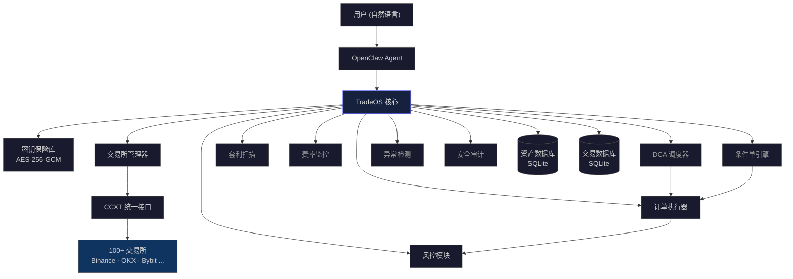

<div align="center">

# TradeOS

**面向 AI Agent 的机构级 CEX 交易基础设施**

<p align="center">
  <a href="https://github.com/00xLazy/TradeOS/releases"></a>
  <a href="https://github.com/ccxt/ccxt"></a>
  <a href="https://www.typescriptlang.org/"></a>
  <a href="https://github.com/00xLazy/TradeOS/blob/main/LICENSE"></a>
</p>

[English](./README.md) · [简体中文](./README_CN.md)

</div>

---

## 概述

TradeOS 是一个 [OpenClaw](https://github.com/openclaw/openclaw) Skill（AI Agent 插件），为大语言模型提供完整的中心化交易所（CEX）交易能力。用户通过自然语言即可在 100+ 家加密货币交易所上执行交易、管理资产、运行量化策略。

它不是一个交易机器人，而是一层**交易基础设施** -- 将交易所操作抽象为 AI Agent 可调用的标准化工具集，同时在每个环节嵌入机构级的安全与风控机制。

---

## 功能矩阵

| 模块 | 能力 | 说明 |
|:-----|:-----|:-----|
| 密钥保险库 | API Key 加密存储 | AES-256-GCM 加密，PBKDF2 密钥派生（600K 迭代），自动拒绝含提现权限的 Key |
| 交易引擎 | 多交易所订单执行 | 市价/限价/止损/止盈，现货与合约，强制预览+确认流程 |
| DCA 定投 | 自动化定投策略 | 按小时/日/周/月频率执行，追踪均价与未实现盈亏 |
| 套利扫描 | 跨交易所价差检测 | 实时 ask/bid 比较，扣除手续费后净利润计算，阈值告警 |
| 资金费率监控 | 永续合约费率追踪 | 跨所费率对比，年化收益计算，操作方向建议 |
| 条件单 | 价格触发自动交易 | 价格上穿/下穿触发，一次性或持续模式，可配置冷却期 |
| 异常检测 | 账户安全监控 | 余额异常下降、未知订单活动、API 故障告警 |
| 安全审计 | API Key 健康评估 | 百分制评分，Key 年龄/权限/IP 白名单/连接状态四维检查 |
| 风控系统 | 交易风险管控 | 单笔限额、日累计限额、最大杠杆、冷却期、交易对黑名单 |
| 资产追踪 | 多所聚合资产总览 | USD 估值，历史快照，净值曲线，每日摘要 |
| 损益报告 | 周期化收益分析 | 按 1d/7d/30d/90d 生成报告，按币种拆分，交易统计与胜率 |

---

## 架构



---

## 快速开始

**前置要求:** 已安装 [OpenClaw](https://github.com/openclaw/openclaw)，Node.js >= 22

**第一步 -- 克隆仓库**

```bash
git clone https://github.com/00xLazy/TradeOS.git ~/.openclaw/skills/TradeOS
```

**第二步 -- 安装依赖并构建**

```bash
cd ~/.openclaw/skills/TradeOS && npm install && npm run build
```

**第三步 -- 初始化**

在 OpenClaw 中加载 TradeOS Skill，然后通过自然语言初始化密钥保险库：

> "初始化 TradeOS 保险库，密码设为 my-secure-password"

---

## 支持的交易所

| 交易所 | ID | 现货 | 合约 |
|:-------|:---|:----:|:----:|
| Binance | `binance` | Yes | Yes |
| OKX | `okx` | Yes | Yes |
| Bybit | `bybit` | Yes | Yes |
| Gate.io | `gateio` | Yes | Yes |
| Bitget | `bitget` | Yes | Yes |
| Coinbase | `coinbase` | Yes | -- |
| KuCoin | `kucoin` | Yes | Yes |
| HTX (火币) | `htx` | Yes | Yes |
| MEXC | `mexc` | Yes | Yes |
| Crypto.com | `cryptocom` | Yes | -- |

> 基于 CCXT 构建，可接入其支持的全部 100+ 家交易所。上表为预配置的主流交易所。

---

<details>
<summary><strong>使用示例</strong></summary>

<br/>

**交易下单**

```
你:     帮我在币安市价买入 500 美元的 BTC
Agent:
        订单预览
        ────────────────
        交易所: Binance
        交易对: BTC/USDT
        方向:   买入
        类型:   市价单
        金额:   $500
        当前价: $84,302
        预估数量: 0.00593 BTC
        预估手续费: $0.50
        ────────────────
        请回复"确认"执行此订单。

你:     确认
Agent:  成交。均价 $84,302.50，数量 0.00593 BTC，手续费 0.0000059 BTC。
```

**DCA 定投**

```
你:     设置一个每天定投 50 美元 ETH 的计划
Agent:
        定投计划已创建
        ────────────────
        名称:     每日 ETH 定投
        交易所:   Binance
        交易对:   ETH/USDT
        金额:     $50/天
        状态:     运行中
        下次执行: 明天 00:00
```

**跨所套利扫描**

```
你:     扫描 OKX 和 Binance 之间 SOL/USDT 的套利机会
Agent:
        套利扫描结果
        ────────────────
        SOL/USDT
        在 OKX 买入:      $148.20 (ask)
        在 Binance 卖出:   $149.05 (bid)
        价差: 0.57%
        净利润: 0.37% (扣除 0.1% x 2 手续费)
        ────────────────
        提示: 净利润超过阈值 (0.5%)，可关注该机会。
```

**资产总览**

```
你:     看看我所有交易所的总资产
Agent:
        资产总览
        ────────────────
        Binance:  $45,230 (0.3 BTC, 5 ETH, 10000 USDT)
        OKX:      $12,800 (2 SOL, 8000 USDT)
        ────────────────
        总计: $58,030
        分布: BTC 42% | ETH 20% | USDT 31% | SOL 7%
```

**条件单**

```
你:     BTC 跌到 8 万帮我买 0.01 个
Agent:
        条件单已创建
        ────────────────
        名称:     BTC 价格低于 $80,000 买入
        交易所:   Binance
        交易对:   BTC/USDT
        条件:     价格跌破 $80,000
        操作:     市价买入 0.01 BTC
        模式:     一次性
        状态:     监控中 (每 15 秒检查)
```

</details>

---

## 数据存储

所有数据完全存储在本地，不会上传至任何云端服务。

```
~/.openclaw/skills/TradeOS/
├── vault/
│   └── exchanges.enc.json        # 加密的 API Key (AES-256-GCM)
├── data/
│   ├── portfolio.db              # 资产快照历史 (SQLite)
│   └── trades.db                 # 交易记录 (SQLite)
├── alerts/
│   └── rules.json                # 告警规则配置
├── dca/
│   ├── plans.json                # 定投计划配置
│   └── history.json              # 定投执行历史
├── arbitrage/
│   └── config.json               # 套利扫描配置
├── funding/
│   └── config.json               # 资金费率监控配置
├── conditional-orders/
│   ├── orders.json               # 条件单配置
│   └── history.json              # 条件单执行历史
├── anomaly/
│   ├── config.json               # 异常检测配置
│   └── snapshots.json            # 余额快照历史
├── security/
│   ├── config.json               # 安全报告配置
│   └── last-report.json          # 上次安全报告
└── risk-rules.json               # 风控规则配置
```

- 数据文件权限设为 `600`（仅所有者可读写）
- SQLite 提供高效的本地结构化存储
- `.gitignore` 已排除所有敏感文件（`*.enc.json`、`*.db`）

---

## 安全模型

<table>
<tr>
<td width="50%">

**TradeOS 的安全措施**

- 所有 API Key 写入磁盘前使用 **AES-256-GCM** 加密
- **自动拒绝**含提现权限的 API Key
- 每笔手动交易必须经过**预览 + 确认**流程
- DCA / 条件单执行时风控模块**强制介入**
- 日志和消息中 API Key **自动脱敏**
- 所有数据文件权限设为 **`chmod 600`**

</td>
<td width="50%">

**你应该做的**

- **永远不要**给 API Key 授予提现权限
- 在交易所后台**设置 IP 白名单**
- 使用**强密码**作为密钥保险库的主密码
- **检查并调整风控规则**，匹配自身风险承受能力
- 在**安全的私人设备**上运行 OpenClaw

</td>
</tr>
</table>

---

<details>
<summary><strong>项目结构</strong></summary>

<br/>

| 模块 | 文件 | 职责 |
|:-----|:-----|:-----|
| 入口 | `scripts/index.ts` | 统一初始化，注册所有模块 |
| 密钥保险库 | `scripts/key-vault.ts` | AES-256-GCM 加密存储，PBKDF2 密钥派生，拒绝含提现权限的 Key |
| 交易所管理器 | `scripts/exchange-manager.ts` | CCXT 多交易所连接管理，余额查询，行情接口 |
| 订单执行器 | `scripts/order-executor.ts` | 市价/限价/止损/止盈订单，强制预览+确认，合约杠杆控制 |
| 风控模块 | `scripts/risk-guard.ts` | 单笔限额、日累计限额、最大杠杆、冷却期、黑名单 |
| 资产追踪 | `scripts/portfolio-tracker.ts` | SQLite 存储资产快照，历史对比，净值曲线 |
| 余额监控 | `scripts/balance-monitor.ts` | 价格/余额/涨跌幅告警，可配置冷却期 |
| 损益追踪 | `scripts/pnl-tracker.ts` | 按周期生成损益报告，按币种拆分，交易统计 |
| DCA 调度器 | `scripts/dca-scheduler.ts` | 自动定投计划（小时/日/周/月），执行历史，盈亏追踪 |
| 套利扫描 | `scripts/arbitrage-scanner.ts` | 跨所 ask/bid 价差检测，净利润计算，阈值告警 |
| 费率监控 | `scripts/funding-rate-monitor.ts` | 永续合约费率监控，年化收益计算，操作方向建议 |
| 条件单 | `scripts/conditional-order.ts` | 价格触发条件单，一次性/持续模式，自动执行含风控 |
| 异常检测 | `scripts/anomaly-detector.ts` | 余额异常检测，未知订单告警，API 故障追踪 |
| 安全审计 | `scripts/security-reporter.ts` | 定期 API Key 安全审计，百分制评分，可操作建议 |
| 安全工具 | `scripts/security-utils.ts` | 共享安全工具函数 |

</details>

---

## 许可证与致谢

[MIT License](./LICENSE) -- 00xLazy

- [OpenClaw](https://github.com/openclaw/openclaw) -- 开源 AI Agent 平台
- [CCXT](https://github.com/ccxt/ccxt) -- 统一加密货币交易所 API
- [better-sqlite3](https://github.com/WiseLibs/better-sqlite3) -- 高性能 Node.js SQLite 库

<div align="center">
<br/>

为自主交易基础设施而生。

</div>
