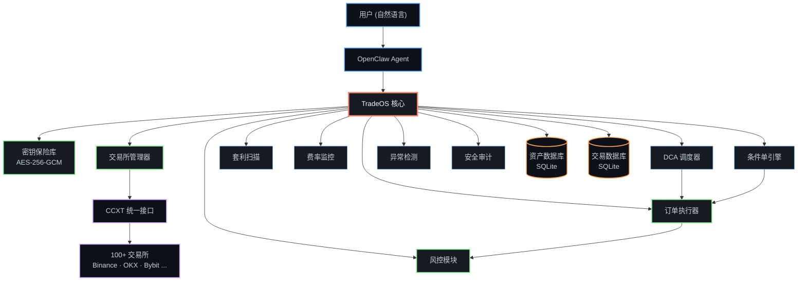

<div align="center">

```
████████╗██████╗  █████╗ ██████╗ ███████╗ ██████╗ ███████╗
╚══██╔══╝██╔══██╗██╔══██╗██╔══██╗██╔════╝██╔═══██╗██╔════╝
   ██║   ██████╔╝███████║██║  ██║█████╗  ██║   ██║███████╗
   ██║   ██╔══██╗██╔══██║██║  ██║██╔══╝  ██║   ██║╚════██║
   ██║   ██║  ██║██║  ██║██████╔╝███████╗╚██████╔╝███████║
   ╚═╝   ╚═╝  ╚═╝╚═╝  ╚═╝╚═════╝ ╚══════╝ ╚═════╝ ╚══════╝
```

### `> 面向 AI Agent 的机构级 CEX 交易基础设施_`

<br />

[](https://github.com/00xLazy/TradeOS/releases)
[](https://www.typescriptlang.org/)
[](https://github.com/ccxt/ccxt)
[](./LICENSE)
[](https://github.com/openclaw/openclaw)

<br />

[English](./README.md) · [简体中文](./README_CN.md)

<br />


</div>

<div align="center">

## 什么是 TradeOS？

**一句话交易。一层基础设施掌控一切。**

</div>

<div align="center">

TradeOS 是一个 [OpenClaw](https://github.com/openclaw/openclaw) Skill（AI Agent 插件），为大语言模型提供完整的中心化交易所（CEX）交易能力。用户通过自然语言即可在 **100+ 家加密货币交易所**上执行交易、管理资产、运行量化策略。

它不是一个交易机器人，而是一层**交易基础设施** — 将交易所操作抽象为 AI Agent 可调用的标准化工具集，同时在每个环节嵌入机构级的安全与风控机制。

</div>

```
┌─────────────────────────────────────────────────────────────┐
│  所有 API Key 写入磁盘前使用 AES-256-GCM 加密              │
│  所有数据完全本地存储 — 零云端依赖                          │
│  所有交易必须经过明确确认                                   │
└─────────────────────────────────────────────────────────────┘
```

<div align="center">
<br />


## 功能矩阵

</div>

<div align="center">
<table>
<tr>
<td width="50%">

**安全与基础设施**

| 模块 | 能力 |
|:--|:--|
| **密钥保险库** | AES-256-GCM + PBKDF2（600K 迭代） |
| **风控系统** | 单笔限额、日累计限额、杠杆上限 |
| **异常检测** | 余额异常、未知订单、API 故障告警 |
| **安全审计** | 逐交易所健康评分 |

</td>
<td width="50%">

**交易与分析**

| 模块 | 能力 |
|:--|:--|
| **交易引擎** | 市价 / 限价 / 止损 / 止盈，现货与合约 |
| **资产追踪** | 多所聚合、历史快照 |
| **损益报告** | 日、周、月、季度报告 |

</td>
</tr>
<tr>
<td width="50%">

**自动化策略**

| 模块 | 能力 |
|:--|:--|
| **DCA 定投** | 按小时 / 日 / 周 / 月自动买入 |
| **条件单** | 价格触发，一次性或持续 + 冷却期 |

</td>
<td width="50%">

**市场情报**

| 模块 | 能力 |
|:--|:--|
| **套利扫描** | 跨交易所价差检测（扣除手续费） |
| **资金费率** | 永续合约收益追踪与告警 |

</td>
</tr>
</table>
</div>

<div align="center">
<br />


## 架构

</div>



<div align="center">
<br />


## 快速开始

**前置要求:** 已安装 [OpenClaw](https://github.com/openclaw/openclaw)，Node.js >= 22

</div>

```bash
# 1. 克隆到 OpenClaw Skills 目录
git clone https://github.com/00xLazy/TradeOS.git ~/.openclaw/skills/TradeOS

# 2. 安装依赖并构建
cd ~/.openclaw/skills/TradeOS && npm install && npm run build
```

<div align="center">

然后在 OpenClaw 中通过自然语言初始化：

</div>

```
> "初始化 TradeOS 保险库，密码设为 my-secure-password"
> "添加我的币安 API Key，Key 是 XXXX，Secret 是 YYYY"
```

<div align="center">

TradeOS 会加密存储凭证、验证连接、检查权限范围，并**自动拒绝含提现权限的 Key**。

<br />


## 支持的交易所

| 交易所 | ID | 现货 | 合约 | |
|:--|:--|:--:|:--:|:--|
| **Binance** | `binance` | Yes | Yes | 全球交易量最大 |
| **OKX** | `okx` | Yes | Yes | 高级衍生品平台 |
| **Bybit** | `bybit` | Yes | Yes | 领先的永续合约交易所 |
| **Gate.io** | `gateio` | Yes | Yes | 1700+ 交易对 |
| **Bitget** | `bitget` | Yes | Yes | 跟单交易领导者 |
| **Coinbase** | `coinbase` | Yes | — | 美国合规交易所 |
| **KuCoin** | `kucoin` | Yes | Yes | 人民的交易所 |
| **HTX (火币)** | `htx` | Yes | Yes | 全球数字资产平台 |
| **MEXC** | `mexc` | Yes | Yes | 快速上币交易所 |
| **Crypto.com** | `cryptocom` | Yes | — | 消费者友好平台 |

**100+ 家交易所**通过 [CCXT](https://github.com/ccxt/ccxt) 支持。只要交易所提供 REST API，TradeOS 就能接入。

<br />


## 使用示例

</div>

<details open>
<summary><strong>交易下单</strong></summary>

```
你:      帮我在币安市价买入 500 美元的 BTC

TradeOS: ┌─ 订单预览 ──────────────────────────┐
         │ 交易所:    Binance                   │
         │ 交易对:    BTC/USDT                  │
         │ 方向:      买入                      │
         │ 类型:      市价单                    │
         │ 金额:      $500                      │
         │ 当前价:    $84,302                   │
         │ 预估数量:  0.00593 BTC               │
         │ 预估手续费: $0.50                    │
         │ 风控检查:  PASSED                    │
         └────────────────────────────────────────┘
         请回复"确认"执行此订单。

你:      确认

TradeOS: 成交 @ $84,302.50 | 0.00593 BTC | 手续费: 0.0000059 BTC
```

</details>

<details>
<summary><strong>DCA 定投</strong></summary>

```
你:      设置一个每天定投 50 美元 ETH 的计划

TradeOS: ┌─ 定投计划已创建 ────────────────────┐
         │ 名称:     每日 ETH 定投             │
         │ 交易所:   Binance                   │
         │ 交易对:   ETH/USDT                  │
         │ 金额:     $50/天                    │
         │ 状态:     RUNNING                   │
         │ 下次执行: 明天 00:00                │
         └────────────────────────────────────────┘
```

</details>

<details>
<summary><strong>跨所套利扫描</strong></summary>

```
你:      扫描 OKX 和 Binance 之间 SOL/USDT 的套利机会

TradeOS: ┌─ 套利扫描结果 ─────────────────────┐
         │                                     │
         │ SOL/USDT                            │
         │ 在 OKX 买入:      $148.20 (ask)    │
         │ 在 Binance 卖出:  $149.05 (bid)    │
         │ 毛价差:           0.57%            │
         │ 净利润:           0.37% (扣手续费) │
         │                                     │
         │ 净利润超过阈值，可关注该机会        │
         └────────────────────────────────────────┘
```

</details>

<details>
<summary><strong>资产总览</strong></summary>

```
你:      看看我所有交易所的总资产

TradeOS: ┌─ 资产总览 ─────────────────────────┐
         │                                     │
         │ Binance ............. $45,230.00    │
         │ OKX ................ $12,800.00    │
         │                   ──────────────    │
         │ 总计:             $58,030.00       │
         │                                     │
         │ ██████████████░░░░░░ BTC   42%     │
         │ █████████░░░░░░░░░░░ ETH   20%     │
         │ ███████░░░░░░░░░░░░░ USDT  31%     │
         │ ██░░░░░░░░░░░░░░░░░░ SOL    7%     │
         └────────────────────────────────────────┘
```

</details>

<details>
<summary><strong>条件单</strong></summary>

```
你:      BTC 跌到 8 万帮我买 0.01 个

TradeOS: ┌─ 条件单已创建 ─────────────────────┐
         │ 触发条件:  BTC/USDT < $80,000.00   │
         │ 操作:      市价买入 0.01 BTC        │
         │ 交易所:    Binance                  │
         │ 模式:      一次性                   │
         │ 状态:      MONITORING (每 15 秒检查)│
         └────────────────────────────────────────┘
```

</details>

<div align="center">
<br />


## 数据存储

所有数据**完全存储在本地**，不会上传至任何云端服务。

</div>

```
~/.openclaw/skills/TradeOS/
│
├── vault/
│   └── exchanges.enc.json          加密的 API Key (AES-256-GCM)
│
├── data/
│   ├── portfolio.db                资产快照历史 (SQLite)
│   └── trades.db                   交易记录 (SQLite)
│
├── alerts/
│   └── rules.json                  告警规则配置
│
├── dca/
│   ├── plans.json                  定投计划配置
│   └── history.json                定投执行历史
│
├── arbitrage/
│   └── config.json                 套利扫描配置
│
├── funding/
│   └── config.json                 资金费率监控配置
│
├── conditional-orders/
│   ├── orders.json                 条件单配置
│   └── history.json                条件单执行历史
│
├── anomaly/
│   ├── config.json                 异常检测配置
│   └── snapshots.json              余额快照历史
│
├── security/
│   ├── config.json                 安全报告配置
│   └── last-report.json            上次安全报告
│
└── risk-rules.json                 风控规则配置
```

<div align="center">

- 数据文件权限设为 `600`（仅所有者可读写）
- SQLite 提供高效的本地结构化存储
- `.gitignore` 已排除所有敏感文件（`*.enc.json`、`*.db`）

<br />


## 安全模型

</div>

<div align="center">
<table>
<tr>
<td>

**TradeOS 的安全措施**

- 所有 API Key 写入磁盘前使用 **AES-256-GCM** 加密
- **自动拒绝**含提现权限的 API Key
- 每笔手动交易必须经过**预览 + 确认**流程
- 所有数据文件权限设为 **`chmod 600`**
- 日志和消息中 API Key **自动脱敏**
- DCA / 条件单执行时风控模块**强制介入**

</td>
<td>

**你应该做的**

- **永远不要**给 API Key 授予提现权限
- 在交易所后台**设置 IP 白名单**
- 使用**强密码**作为密钥保险库的主密码
- **检查并调整风控规则**，匹配自身风险承受能力
- 在**安全的私人设备**上运行 OpenClaw

</td>
</tr>
</table>
</div>

<div align="center">
<br />

</div>

<details>
<summary><strong>项目结构</strong></summary>

<br />

| 模块 | 文件 | 职责 |
|:--|:--|:--|
| 入口 | `scripts/index.ts` | 统一初始化，注册所有模块 |
| 密钥保险库 | `scripts/key-vault.ts` | AES-256-GCM 加密存储，PBKDF2 密钥派生 |
| 交易所管理器 | `scripts/exchange-manager.ts` | CCXT 多交易所连接管理，余额查询，行情接口 |
| 订单执行器 | `scripts/order-executor.ts` | 市价/限价/止损/止盈，强制预览+确认，合约杠杆控制 |
| 风控模块 | `scripts/risk-guard.ts` | 单笔限额、日累计限额、最大杠杆、冷却期、黑名单 |
| 资产追踪 | `scripts/portfolio-tracker.ts` | SQLite 存储资产快照，历史对比，净值曲线 |
| 余额监控 | `scripts/balance-monitor.ts` | 价格/余额/涨跌幅告警，可配置冷却期 |
| 损益追踪 | `scripts/pnl-tracker.ts` | 按周期生成损益报告，按币种拆分，交易统计 |
| DCA 调度器 | `scripts/dca-scheduler.ts` | 自动定投计划，执行历史，盈亏追踪 |
| 套利扫描 | `scripts/arbitrage-scanner.ts` | 跨所 ask/bid 价差检测，净利润计算 |
| 费率监控 | `scripts/funding-rate-monitor.ts` | 永续合约费率监控，年化收益计算 |
| 条件单 | `scripts/conditional-order.ts` | 价格触发条件单，一次性/持续模式 |
| 异常检测 | `scripts/anomaly-detector.ts` | 余额异常检测，未知订单告警，API 故障追踪 |
| 安全审计 | `scripts/security-reporter.ts` | 定期 API Key 安全审计，百分制评分 |
| 安全工具 | `scripts/security-utils.ts` | 共享安全工具函数 |

</details>

<div align="center">

<br />

## 许可证与致谢

[MIT License](./LICENSE) — 00xLazy

- [OpenClaw](https://github.com/openclaw/openclaw) — 开源 AI Agent 平台
- [CCXT](https://github.com/ccxt/ccxt) — 统一加密货币交易所 API
- [better-sqlite3](https://github.com/WiseLibs/better-sqlite3) — 高性能 Node.js SQLite 库

<br />


<br />

```
为自主交易基础设施而生。
```

<br />

<sub>Made by <a href="https://github.com/00xLazy">00xLazy</a></sub>

</div>
